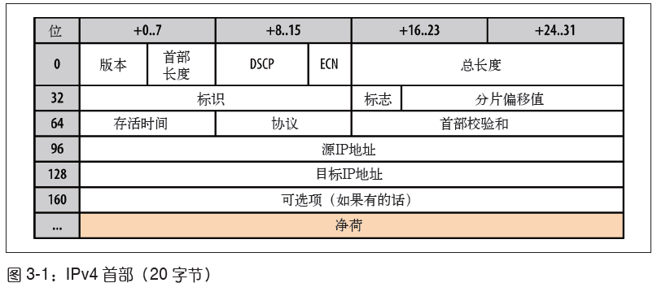

### Part 1 网络技术概览

#### Chapter1 延迟与带宽

> 速度是关键。要提高速度，必须先了解与之相关的各种因素，以及根本性
> 的限制。本章主要介绍对所有网络通信都有决定性影响的两个方面：延迟和带宽。
>
> 延迟：分组从信息源发送到目的地所需的时间。
>
> 带宽：逻辑或物理通信路径最大的吞吐量。

延迟影响因素：

1. 传播延迟：信号传播速度。信号传播距离和速度的函数
2. 传输延迟：数据在链路中转移速度。消息长度和链路速率的函数
3. 处理延迟：处理分组首部、检查位错误及确定分组目标所需的时间
4. 排队延迟：到来的分组排队等待处理的时间

`客户端-------线缆-------路由器-------线缆-------服务端`

CDN的作用：让用户从最近的服务器加载内容，减少传播(来回)距离，降低传播分组时间。

最后一公里：大部分延迟都在最后一段距离内，这里部署了ISP的路由器，由于部署方式五花八门，从信号发出到信号到达主路由器的时间往往很大。可以用`traceroute <site>`试试。

波分复用（WDM）：光纤同时传输不同波长(信道)的光束。

目标：高带宽，低延迟。(延迟比带宽占影响更大)

#### Charpter 2 TCP的构成

1. TCP负责在不可靠的传输信道之上提供可靠的抽象层，向应用层隐藏了大多数网络通信的复杂细节，比如丢包重发、按序发送、拥塞控制及避免、数据完整等等。采用TCP 数据流可以确保发送的所有字节能够完整地被接收到，而且到达客户端的顺序也一样。

2. 三次握手
   
3. 拥塞控制

* 流量控制：流量控制是一种预防发送端过多向接收端发送数据的机制。每一方都通告自己的接收窗口rwnd，其中包含能够保存数据的缓冲区空间大小信息。
  
* 慢启动
  
  
  短暂的小文件传输不利(初始窗口小，传输量少)
  
  
* 拥塞预防：把丢包作为网络拥塞的标志。调整窗口、删包，以避免造成更多包丢失。

4. 带宽延迟积BDP：数据链路的容量与其端到端延迟的乘积。这个结果就是任意时刻处于在途未确认状态的最大数据量。
   
5. 队首阻塞：中途有某分组丢失了，后续分组必须保存在接收端的tcp缓冲区，等待丢失分组重发并到达接收端，而应用程序只能等到所有分组全部到达才能访问数据。
   
   抖动：应用程序不用关心分组重排和重组，代码更加简洁，但分组到达时间会存在无法预知的延迟变化(tcp必须按序交付)。对那些无需按照顺序交付数据、或者能够处理分组丢失的应用、以及对延迟或抖动要求很高的应用，可以选UDP协议。
6. TCP影响：
   * TCP三次握手增加了整一次往返时间
   * 慢启动将应用到每个新连接
   * 流量及拥塞控制会影响所有连接的吞吐量
   * 吞吐量由当前拥塞窗口大小控制
   * 分组必须顺序交付
7. 服务器调优
   * 增大TCP初始拥塞窗口
   * 慢启动重启：在连接空闲时禁用慢启动可以改善瞬时发送数据的长TCP 连接的性能。
   * 窗口缩放：启用窗口缩放可以增大最大接收窗口大小，可以让高延迟的连接达到更好吞吐量。
   * TCP快速打开：在某些条件下，允许在第一个SYN 分组中发送应用程序数据。TFO（TCP Fast Open，TCP 快速打开）是一种新的优化选项，需要客户端和服务器共同支持。为此，首先要搞清楚你的应用程序是否可以利用这个特性。
8. 应用程序调优
   * 减少TCP请求数量
   * 减少传输距离
   * 重用TCP连接
   * 降低数据包大小
9. 清单
   * 服务器内核升级到最新版本(linux 3.2+)
   * 确保cwnd大小为10
   * 禁用空闲后慢启动
   * 确保启动窗口缩放
   * 减少传输冗余数据
   * 压缩要传输的数据
   * 把服务器放到离用户近的地方以减少往返时间
   * 尽最大可能重用已经建立的连接

#### Chapter 4 UDP的构成

1. 基础概念
   * 数据报(datagram):描述那些通过不可靠的服务传输的分组，既不保证送达，也不发送失败通知。
   * 分组(packet): 指代任何格式化的数据块
2. 无协议服务
   * IP协议:IP 层的主要任务就是按照地址从源主机向目标主机发送数据报。如果某个
     路由节点因为网络拥塞、负载过高或其他原因而删除了IP 分组，那么在必要的情况
     下，IP 的上一层协议要负责检测、恢复和重发数据。
     
   * UDP
     
     1. 不保证消息交付
     2. 不保证交付顺序
     3. 不跟踪连接状态
     4. 不需要拥塞控制
3. UDP与网络地址转换器
   
   NAT穿透技术：TURN STUN ICE
   
4. UDP优化建议
   * 应用程序必须容忍各种因特网路径条件；
   * 应用程序应该控制传输速度；
   *  应用程序应该对所有流量进行拥塞控制；
   *  应用程序应该使用与 TCP 相近的带宽；
   *  应用程序应该准备基于丢包的重发计数器；
   *  应用程序应该不发送大于路径 MTU 的数据报；
   *  应用程序应该处理数据报丢失、重复和重排；
   *  应用程序应该足够稳定以支持 2 分钟以上的交付延迟；
   *  应用程序应该支持 IPv4 UDP 校验和，必须支持 IPv6 校验和；
   *  应用程序可以在需要时使用 keep-alive（最小间隔 15 秒）。