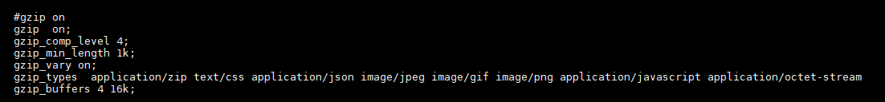

### nginx的gzip效果测试

| css  | js   | gif  | json | dcm/mgjson | 最小压缩阈值 | 压缩等级 | 请求数 | 数据大小     | 耗时    | 结论 |
| ---- | ---- | ---- | ---- | ---------- | ------------ | -------- | ------ | ------------ | ------- | ---- |
| √    | √    | √    | √    | √          | 5k           | 9        | 255    | 26.2MB       | 31.28s  |      |
| √    | √    | √    | √    | X          | 5k           | 9        | 255    | 72.1MB       | 11.07s  |      |
| X    | X    | X    | √    | X          | 5k           | 9        | 255    | 77.8MB       | 10.42s  |      |
| X    | X    | X    | X    | X          | 1k           | 9        | 255    | 87.1MB       | 10.31s  |      |
| √    | √    | √    | √    | X          | 1k           | 9        | 255    | 72MB         | 10.88s  |      |
| √    | √    | √    | √    | X          | 1k           | 4        | 255    | 72.3MB       | 10.15s  |      |
| √    | √    | √    | √    | √          | 1k           | 4        | 255    | **`27.1MB`** | `5.83s` |      |

1. 分析请求列表发现，压缩等级为9和4，对流数据`application/octet-stream`的压缩效果差不多
2. 通过对流数据的压缩，可以显著减少数据传输大小和数据传输时间

| 文件类型   | 传输类型                 |
| ---------- | ------------------------ |
| css        | text/css                 |
| js         | application/javascript   |
| gif        | image/gif                |
| json       | application/json         |
| dcm/mgjson | application/octet-stream |

### 最佳响应效果时，nginx的配置

### 总结

1. 文本数据应当开启gzip，但需要选择好压缩等级，否则适得其反
2. 需要对压缩时间和传输时间做对比，以得到更好的效果
3. 开启gzip应当作为网站优化的第一个步骤(效率高，本测试环境时间和空间占用率都降低了50%！)